# Nexapp — Mobile Screen Handoff

Screen reference for code generation. Each screen has a **light** and **dark** PNG in this folder, **embedded inline below** (side by side) so they render in any Markdown viewer. Filenames are `NN-screen-name-{light|dark}.png`. Screens are numbered 01–12 to match the order below.

> Source of truth for behaviour: `uploads/NEXAPP_mobile_design_instructions.md`. This file describes the **visual** spec captured in the mockups.

---

## 0. App overview

Nexapp is a field-productivity companion (cross‑platform, **Flutter / Material 3**). It auto-tracks the user's day during office hours, lets them capture customer/site visit reports (voice + notes), and surfaces coverage alerts so nothing slips. The mockups use the **NexUI** design system as the visual reference. Build the app in both light and dark; every screen below is shown in both.

### Design system & tokens
- **Design system:** NexUI (`_ds/nexui-design-system-…/`). Use its tokens; do not invent colors.
- **Type:** Geist (sans). Titles `font-semibold`; secondary text smaller + muted.
- **Radius:** cards `~18px`, controls `~13–15px`, pills `999px`.
- **Primary (indigo):** `var(--primary)` ≈ `oklch(0.5629 0.1817 262)`, on `var(--primary-foreground)`.
- **Surfaces:** page `var(--background)`, cards `var(--card)`, body `var(--foreground)`, secondary `var(--muted-foreground)`, hairlines = foreground at ~8–9% alpha.
- **Spectrum gradient (brand accent only):** magenta `#b023f2` → indigo `#5b63ec` → blue `#2f96e6`, ~150°. Used on the app icon, splash, login mark, avatars, the Home tracking card glow, and notification app-glyphs. **Not** on ordinary buttons — those are flat `var(--primary)`.
- **Status semantics:** success/Ready/Granted = green `#16A34A`; warning/Queued/Transcribing/Battery = amber `#D97706`; recording = red `#E0245E`; info/primary actions = indigo.
- **Dark mode:** driven by the `.dark` class flipping the same tokens — never hardcode light values.

### Global navigation
- **Bottom tab bar** (4 tabs) on the shell screens — Home, Reports, Alerts, Settings. Alerts shows an amber count badge. Active tab = indigo (filled icon + label); inactive = muted (outline icon).
- **Detail/capture screens** use a top app bar with a back chevron, not the tab bar.
- **Status bar** is part of each frame (iOS notch / Android). On colored hero backgrounds (splash, lock screen) the status-bar icons are white.

---

## 01 — Splash / Launch
<table>
<tr><th>Light</th><th>Dark</th></tr>
<tr>
<td>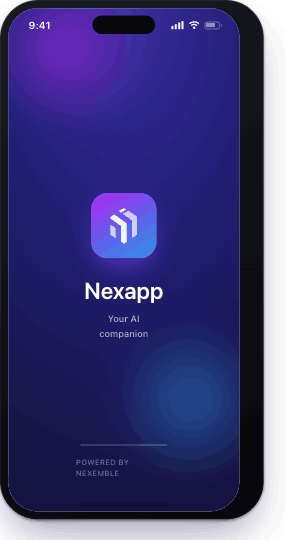</td>
<td></td>
</tr>
</table>

Brand launch moment shown while the app decides where to route (session check). Full-bleed deep-indigo radial background with soft magenta + blue glows. Centered: spectrum-gradient app icon (rounded square, 24px radius), wordmark **"Nexapp"**, subtitle **"Your AI companion"**. Bottom: indeterminate gradient progress bar + **"POWERED BY NEXEMBLE"**. Background is the same in light & dark (brand moment); status-bar icons white.

## 02 — SSO Login
<table>
<tr><th>Light</th><th>Dark</th></tr>
<tr>
<td>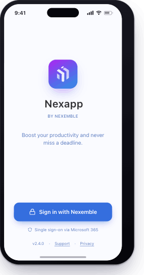</td>
<td>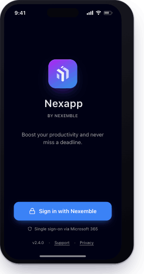</td>
</tr>
</table>

Single sign-on entry. Centered logo lockup (spectrum icon + "Nexapp" + "by Nexemble") over `var(--background)`. Tagline: **"Boost your productivity and never miss a deadline."** Primary full-width button **"Sign in with Nexemble"** (lock icon) → OIDC/Microsoft 365. Sub-caption "Single sign-on via Microsoft 365" (shield). Footer row: version · Support · Privacy. No password fields — SSO only.

## 03 — Onboarding / Permissions
<table>
<tr><th>Light</th><th>Dark</th></tr>
<tr>
<td>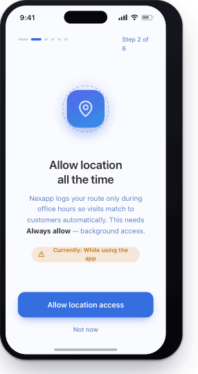</td>
<td>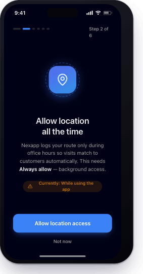</td>
</tr>
</table>

Paged permission wizard (shown: **step 2 of 6**, "Allow location all the time"). Top: segmented progress dots + "Step N of 6". Center: circular illustration (dashed ring + gradient location-pin tile), headline, explanatory body emphasising **Always allow / background**, and an amber status pill **"Currently: While using the app"**. Actions: primary **"Allow location access"** + ghost **"Not now"**. Other steps follow the same template (notifications, battery optimization, etc.).

## 04 — Home / Tracking status  *(shell tab)*
<table>
<tr><th>Light</th><th>Dark</th></tr>
<tr>
<td>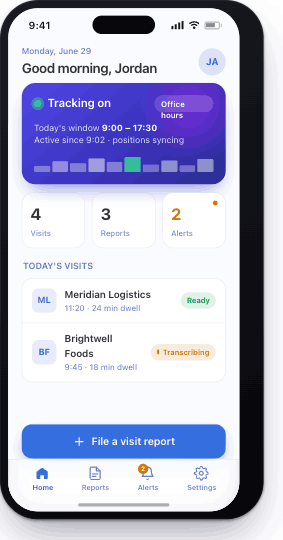</td>
<td>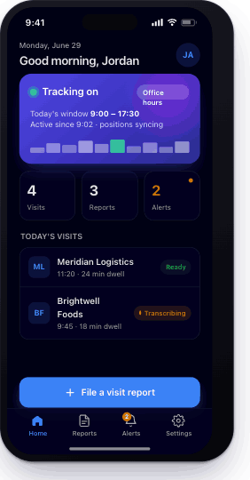</td>
</tr>
</table>

Landing tab. App bar: date + "Good morning, {name}" + avatar (gradient initials).
- **Tracking card** (hero): indigo gradient with magenta glow + spectrum accent. Live status dot ("Tracking on"), "Office hours" pill, today's window `9:00–17:30`, and a small activity bar-graph (green = current).
- **Today stats row:** 3 tiles — Visits, Reports, Alerts (Alerts tile amber with a dot).
- **Today's visits list** card: rows with entity avatar, name, time + dwell, and a status chip (green "Ready", amber "Transcribing").
- Floating primary CTA **"File a visit report"** above the bottom tab bar (Home active).
> Platform parity: the same screen exists on Android (Material status bar / nav) — see the canvas; build both.

## 05 — Visit Report — Capture  ★ core
<table>
<tr><th>Light</th><th>Dark</th></tr>
<tr>
<td>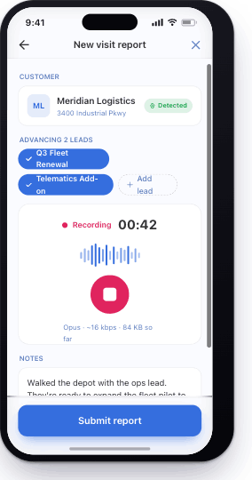</td>
<td>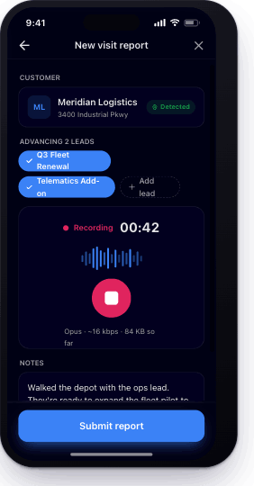</td>
</tr>
</table>

The core flow. Top app bar (back / "New visit report" / close).
- **Customer** card: detected entity (avatar, name, address) + green **"Detected"** pill (from geofence match).
- **Advancing N leads:** selectable indigo lead pills (checkmark) + dashed **"Add lead"** chip.
- **Recorder** card: red "Recording" + tabular timer `00:42`, live waveform (indigo bars), large red stop button, codec/size caption (Opus ~16 kbps).
- **Notes** card: editable text with caret.
- **Location** card: lat/long + accuracy `±8 m` + refresh.
- Sticky bottom **"Submit report"** primary button.

## 06 — Submit / Queue confirmation
<table>
<tr><th>Light</th><th>Dark</th></tr>
<tr>
<td>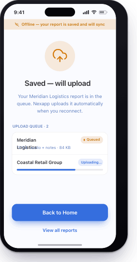</td>
<td>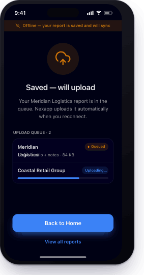</td>
</tr>
</table>

Post-submit, offline-tolerant. Amber top banner **"Offline — your report is saved and will sync"**. Centered amber upload-cloud icon, headline **"Saved — will upload"**, reassurance copy. **Upload queue** card listing items with state chips: amber **"Queued"** and an in-progress **"Uploading…"** row with an indigo progress bar. Actions: primary **"Back to Home"** + text **"View all reports"**. (When online, the banner is hidden and items show success.)

## 07 — Reports — My History  *(shell tab)*
<table>
<tr><th>Light</th><th>Dark</th></tr>
<tr>
<td>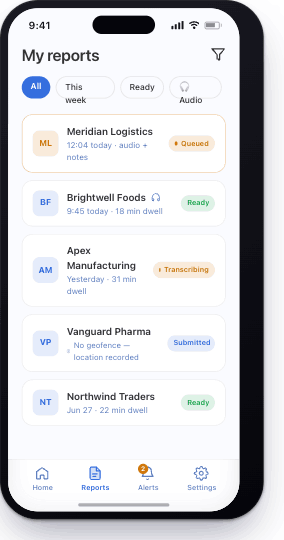</td>
<td>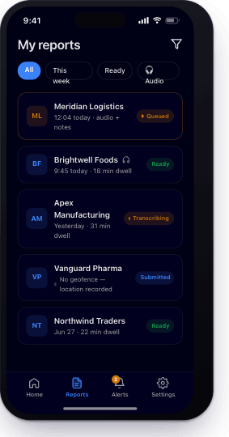</td>
</tr>
</table>

History list. App bar "My reports" + filter icon. Filter chips row (All / This week / Ready / Audio — selected chip = indigo). Scrollable list of report cards, each: entity avatar, name (audio rows show a small headphones/waveform glyph), time + dwell, and a status chip. States represented: amber **Queued** (amber-bordered card), green **Ready**, amber **Transcribing**, indigo **Submitted** (incl. a "No geofence — location recorded" note row). Bottom tab bar (Reports active).

## 08 — Visit Report — Detail / Edit
<table>
<tr><th>Light</th><th>Dark</th></tr>
<tr>
<td>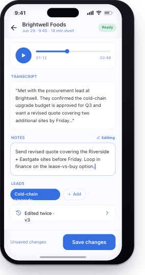</td>
<td>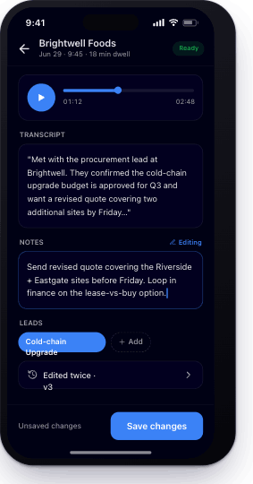</td>
</tr>
</table>

Opened report. Top app bar: back + entity name + date/time/dwell + green "Ready" chip.
- **Audio player** card: round play button, scrub bar with handle, elapsed / total time.
- **Transcript** card: AI transcript text.
- **Notes** card: editable (indigo focus border, "Editing" affordance, caret).
- **Leads** chips (indigo + dashed Add).
- **Version history** row ("Edited twice · v3", chevron).
- Sticky bottom bar: "Unsaved changes" + **"Save changes"** primary button.

## 09 — Alerts — Inbox  *(shell tab)*
<table>
<tr><th>Light</th><th>Dark</th></tr>
<tr>
<td>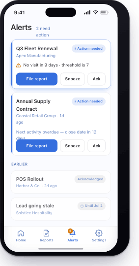</td>
<td>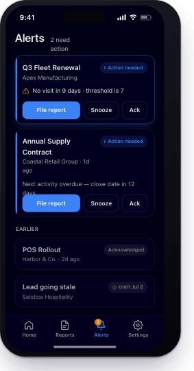</td>
</tr>
</table>

Coverage-alert inbox. App bar "Alerts" + "N need action". Open alerts are emphasised cards with a left indigo accent bar, lead title + account, an amber reason line (e.g. "No visit in 9 days · threshold is 7"), an **"Action needed"** chip, and inline actions **File report / Snooze / Ack**. An **EARLIER** section lists dimmed resolved items with **Acknowledged** / **Snoozed (Until …)** chips. Bottom tab bar (Alerts active, amber badge "2").

## 10 — Alert — Detail
<table>
<tr><th>Light</th><th>Dark</th></tr>
<tr>
<td>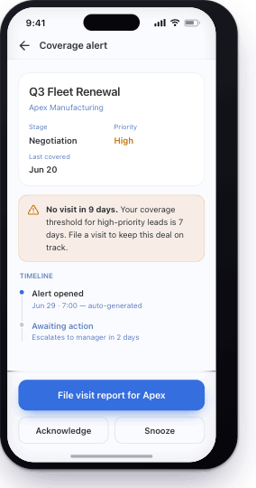</td>
<td>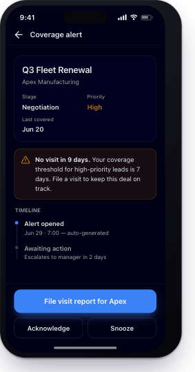</td>
</tr>
</table>

Single alert context + resolution path. Top app bar (back / "Coverage alert").
- **Summary** card: lead title, account, and a 3-up meta row (Stage / Priority [amber "High"] / Last covered).
- **Reason callout** (amber, bordered): bold "No visit in 9 days." + threshold explanation.
- **Timeline**: vertical connector — "Alert opened (auto-generated)" → "Awaiting action / Escalates to manager in 2 days".
- Bottom actions: primary **"File visit report for {account}"** + secondary **Acknowledge** / **Snooze**.

## 11 — Settings / Profile  *(shell tab)*
<table>
<tr><th>Light</th><th>Dark</th></tr>
<tr>
<td>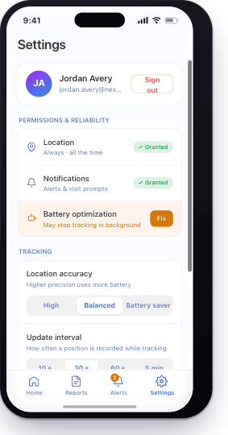</td>
<td>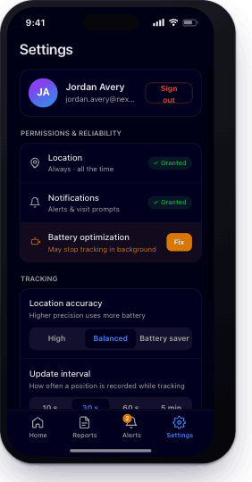</td>
</tr>
</table>

- **Account** card: gradient avatar, name, email (truncates), outlined destructive **Sign out** (does not overlap the email).
- **Permissions & reliability** card: Location (Always), Notifications — each with green **Granted** chip; **Battery optimization** row highlighted amber with a **"Fix"** button (may stop background tracking).
- **Tracking** card *(new)*: **Location accuracy** segmented control — High / **Balanced** / Battery saver; **Update interval** segmented control — 10 s / **30 s** / 60 s / 5 min. (Selected segment = white pill with indigo label in light; elevated in dark.)
- **Device** card: model, device ID, push token (green "Active"), "Registered to you · provisioned in Traccar".
- **Office hours** row (Mon–Fri 9:00–17:30, chevron) + **Diagnostics & logs** row (version/build).
- Bottom tab bar (Settings active).

## 12 — System surfaces (push & notifications)  §2.12
<table>
<tr><th>Light</th><th>Dark</th></tr>
<tr>
<td>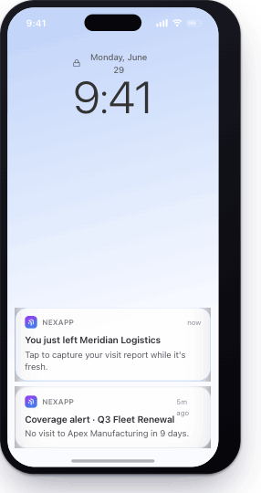</td>
<td>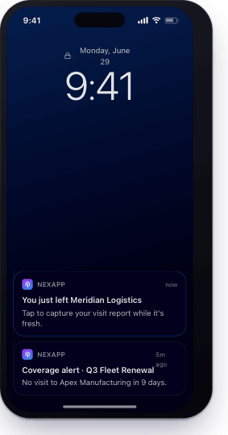</td>
</tr>
</table>

OS-level surfaces (the PNGs show iOS; Android variants exist on the canvas — build both).
- **iOS lock screen:** indigo wallpaper, large clock, stacked notifications. Emphasised **geofence-exit capture prompt** ("You just left {customer} — tap to capture your visit report") + a coverage-alert notification. App glyph uses the spectrum gradient.
- **Android notification shade:** persistent **foreground-service** notification ("Tracking during office hours", Ongoing, low-priority) + a high-priority **coverage alert** with action buttons (FILE REPORT / SNOOZE / ACK) + a geofence capture prompt with actions. Material-style rounded notification cards.

---

## Build notes for codegen
- Map mockup elements to NexUI components where natural: status chips → `Badge`; cards → `Card`; segmented controls → a `Tabs`-style toggle or button group; sticky CTAs → `Button` (`default`/`secondary`/`outline`/`ghost`/`destructive`); list rows → `Card` content rows; transcript → `MarkdownRenderer`; toasts/confirmations → `Sonner`/`AlertDialog`.
- Every async data surface needs the four states: **loading** (skeleton), **empty**, **error**, **403** (hide).
- Honor `.dark` everywhere; both PNGs per screen show the exact intended token mapping.
- Icons: lucide-react equivalents of the line icons shown.
